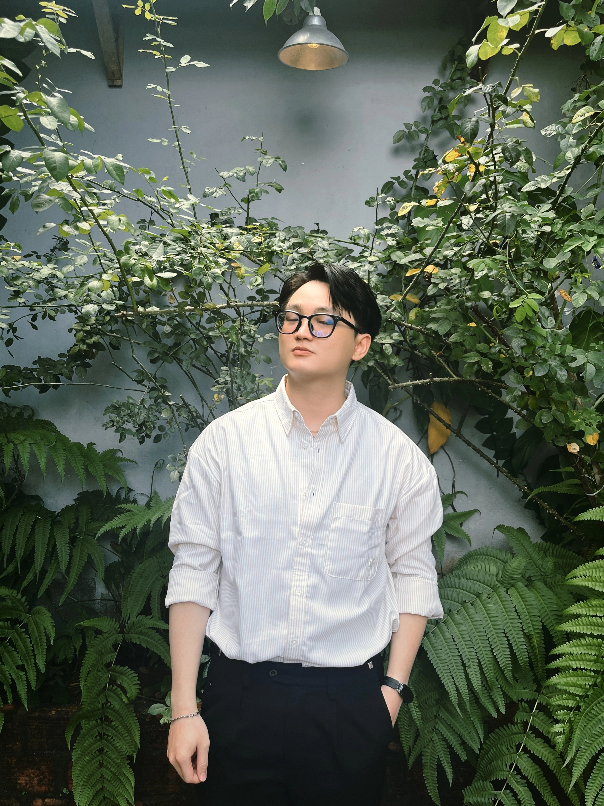
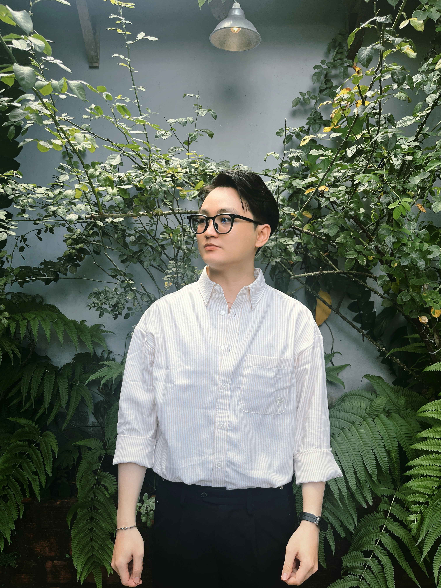

 

 
<video width="100" autoplay muted loop>
  <source src="https://media3.giphy.com/media/v1.Y2lkPTc5MGI3NjExcXIybjBhZjh2Y3BvMXpuYWQ4a2NjNjQzYzh2MmpmNnhyZGZpb2g4byZlcD12MV9pbnRlcm5hbF9naWZfYnlfaWQmY3Q9Zw/KbdF8DCgaoIVC8BHTK/giphy.mp4" type="video/mp4">
</video>
<video width="100" autoplay muted loop>
  <source src="https://media1.giphy.com/media/v1.Y2lkPTc5MGI3NjExczRpaTh0a3Q4enNoN3Z1MnB5dHk5eTJ3ajQwYjY5em83NTR2em8xdCZlcD12MV9pbnRlcm5hbF9naWZfYnlfaWQmY3Q9Zw/2g6sCTsSoVuSfSxK4W/giphy.mp4" type="video/mp4">
</video>
<video width="100" autoplay muted loop>
  <source src="https://media2.giphy.com/media/v1.Y2lkPTc5MGI3NjExc3lrN29hNXhmc3BqMW5zcWVlMmxqc3oxOWt4ZHF3M2Q2cmozdGZkZSZlcD12MV9pbnRlcm5hbF9naWZfYnlfaWQmY3Q9Zw/pY8jLmZw0ElqvVeRH4/giphy.mp4" type="video/mp4">
</video>

---

## About

Front-End Engineer with 2+ years of experience building fast, responsive web apps with React and Next.js. I focus on UI/UX, SEO, and performance-driven interfaces.

- 📍 Base in Vietnam
- 🎯 Frontend, UI/UX, Performance
- 🔧 React, Next.js, TypeScript, Tailwind CSS

## Tech Stack

---

## Experience

- **Front-end Developer @ 4teengames** — rebuilt the main game site with Next.js and Tailwind, focused on SEO and performance.
- **Front-end Intern @ VDTC - ePass** — worked with Angular and TypeScript on internal interfaces.

## GitHub Stats

---

## Contact

**Fast interfaces. Clean details. Strong delivery.**

